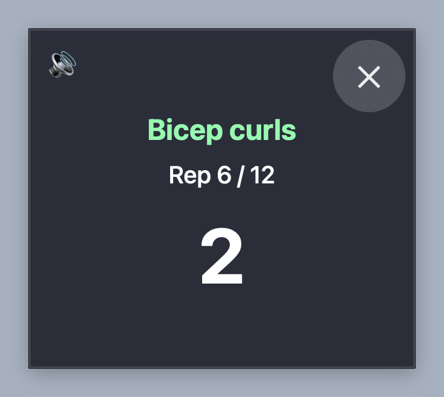

# LiftBell

The bell rings every 30 minutes. You lift.

A macOS menu bar timer that chimes on the half hour and pops up a rep
counter for one short strength set at your desk.

<p align="center">
  
</p>

## What it does

- Menu bar countdown. Chimes when it reaches zero, then restarts.
- 20 seconds after the chime, a floating overlay opens with one exercise:
  wrist curls, bicep curls, overhead press, or bench press. Each exercise
  comes up once before any repeats.
- The overlay counts 12 reps. Each rep is DOWN 3 2 1 UP 1 2, half a second
  per beat, spoken aloud. Close it with the X or Escape.
- Menu items: turn off, I responded, view log, reset timer, cycles today.

## Install

Needs macOS and [uv](https://docs.astral.sh/uv/).

```
./install.sh
```

This copies the scripts to `~/Library/Application Support/ChimeTimer`,
creates a virtualenv there, installs a launch agent, and starts the app.
It runs at login. Rerun `install.sh` after editing `chime.py` or
`overlay.py`.

```
./uninstall.sh
```

Stops the app and removes the launch agent. The live folder and log stay.

## Files

- `chime.py`: menu bar app, built on [rumps](https://github.com/jaredks/rumps).
- `overlay.py`: rep counter window, built on PyObjC.
- `com.williamcole.chimetimer.plist`: launch agent. Paths are hardcoded to
  the author's home folder. Edit them if you are not the author.
